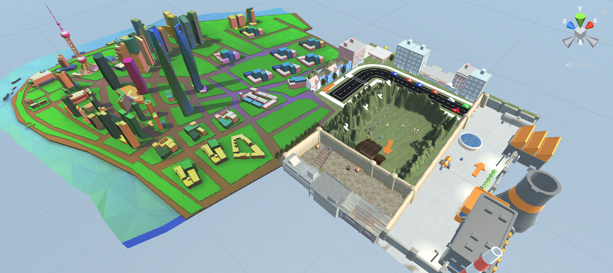

# Urbanization
A VR interactable Gallery based on Oculus Rift. Using Unity 2018.1.6f1, VRTK Version 3.3.0, Oculus Integration Kit (with Oculus Avatar), models from Assets Store and Sketchfab, models made by Google Blocks and C# scripts.

Video Demo: https://youtu.be/hCVKMsgoxR0

<!--# Preview

  

-->

# Conceptual Ideas
This project gives people a new way to interpret urbanization through Virtual Reality. In real life, it is hard to imagine the authentic process of urbanization. Cities are large, factories are large, and country areas are large as well. We can hardly get out from one to another in a real scene, giving us little imagination spaces for urbanization. However, VR provides people a new way to understand the space. Compacting example scenes together, people are free to travel between farms, industrial places and urban areas in a very short distance. By triggering the "magic door," people can get into another place, having a brand new experience. 

Also, it is not just a gallery. The senses of reality in VR cannot be ignored. When people enter the scene, there are sounds around. People can interactive with different game objects like they do in real life, and they can see their hands doing things inside the scene as well.

This project makes use of the concept of Game Theory. Since Oculus Rift only has controllers and headsets, it cannot detect the minor movements of body and cannot simulate entire body of the user. Also, the models cannot put into actual use. Most of them is for visual use only. These deficiencies show the trade-off of Virtual Reality.
